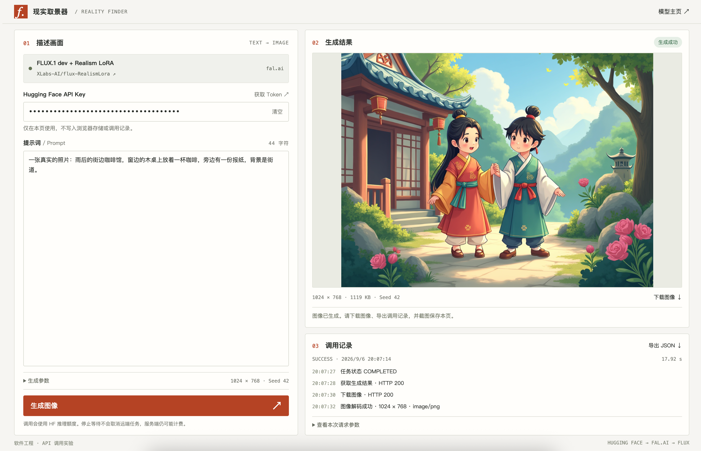
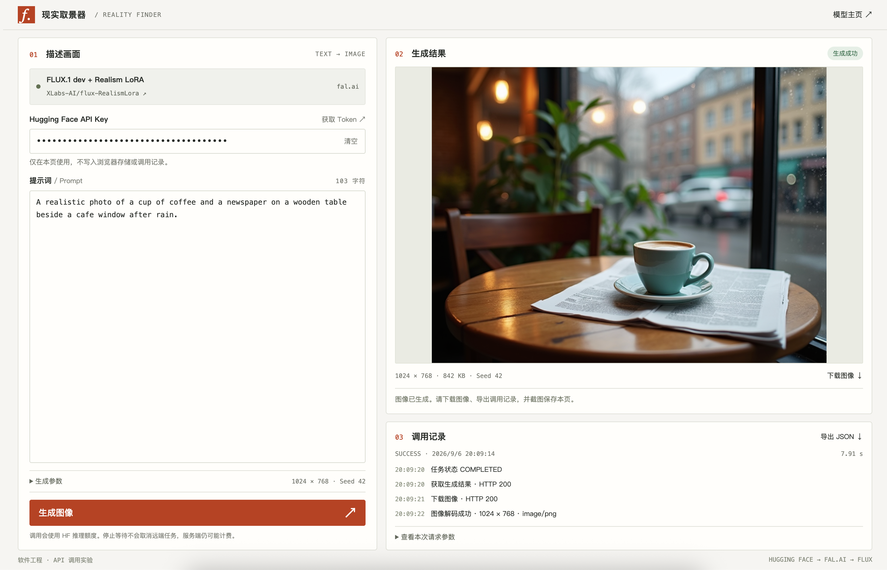
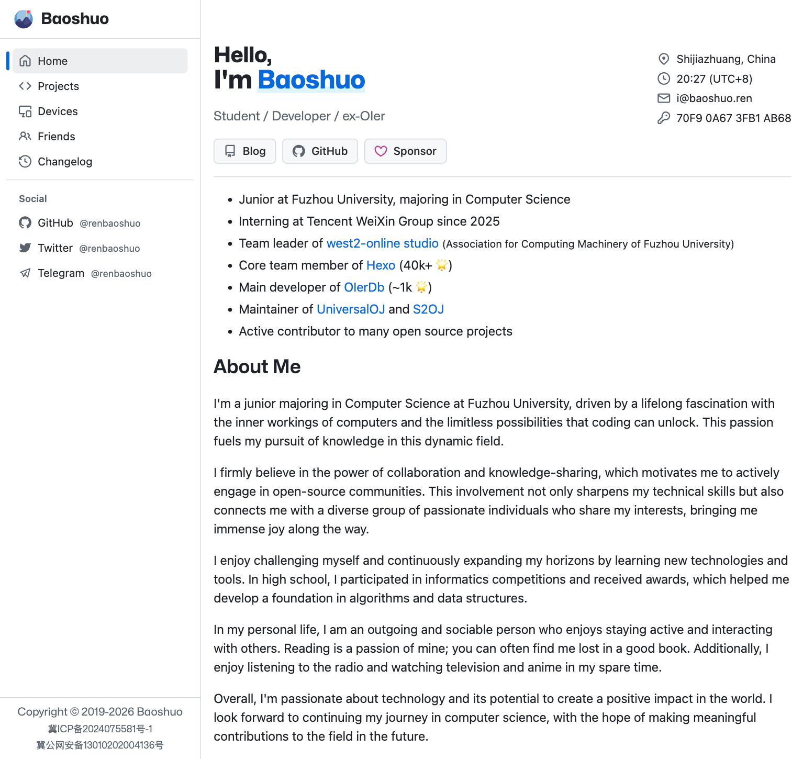
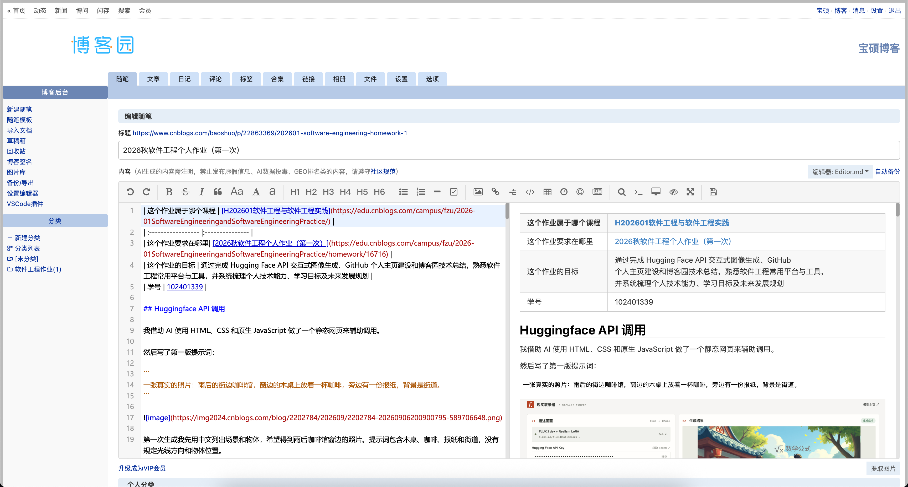

| 这个作业属于哪个课程 | [H202601软件工程与软件工程实践](https://edu.cnblogs.com/campus/fzu/2026-01SoftwareEngineeringandSoftwareEngineeringPractice/)                             |
| :------------------- | :-------------------------------------------------------------------------------------------------------------------------------------------------------- |
| 这个作业要求在哪里   | [2026秋软件工程个人作业（第一次）](https://edu.cnblogs.com/campus/fzu/2026-01SoftwareEngineeringandSoftwareEngineeringPractice/homework/16716)            |
| 这个作业的目标       | 通过完成 Hugging Face API 交互式图像生成、GitHub 个人主页建设和博客园技术总结，熟悉软件工程常用平台与工具，并系统梳理个人技术能力、学习目标及未来发展规划 |
| 学号                 | 102401339                                                                                                                                                 |

## Huggingface API 调用

我借助 AI 使用 HTML、CSS 和原生 JavaScript 做了一个静态网页来辅助调用。

然后写了第一版提示词：

```
一张真实的照片：雨后的街边咖啡馆，窗边的木桌上放着一杯咖啡，旁边有一份报纸，背景是街道。
```



第一次生成我先用中文列出场景和物体，希望得到雨后咖啡馆窗边的照片。提示词包含木桌、咖啡、报纸和街道，没有规定光线方向和物体位置。

返回的图像是两个穿古装的卡通人物，背景有庭院、建筑和树木。画面没有咖啡、木桌或报纸，也没有呈现照片风格。这一轮的接口调用成功了，但图像没有完成提示词描述的任务。

我猜测这一轮偏题的原因是模型对中文提示词的支持不足。提示词已经写明咖啡馆、木桌、咖啡和报纸，模型却没有按这些内容生成画面。

---

于是优化出了第二版提示词：

```
A realistic photo of a cup of coffee and a newspaper on a wooden table beside a cafe window after rain.
```



针对第一轮的中文支持问题，第二版把场景改写成英文，仍然只描述咖啡、报纸、木桌、窗户和雨后环境。返回的图像中，蓝绿色杯子放在杯碟上，杯碟压在展开的报纸上。木桌靠近窗户，玻璃上有水滴，窗外可以看到模糊的建筑和车辆。室内还有暖色灯光和植物。

这张图已经具有照片的外观。杯子和桌面是清楚的，背景有虚化，主要物体与提示词一致。短句没有规定杯子和报纸的相对位置，也没有限定光源，模型补入了灯具、植物和室内布置。

我希望把画面集中到杯子上，让报纸放在一旁，并用窗外的自然光照亮桌面，所以继续修改提示词。

---

第三版：

```
A documentary photograph of a quiet neighborhood cafe on an overcast morning just after rain. On a worn oak table beside a large window sits one off-white ceramic cup of black coffee on a matching saucer, with a folded newspaper lying to its right. The cup is the main subject, placed slightly left of center, photographed from the eye level of a person seated at the table. Soft daylight enters from the window on the left, creating a pale reflection on the coffee and gentle contact shadows beneath the cup and saucer. Show fine scratches in the wood, a small coffee stain near the saucer, uneven ceramic glaze, and a few water droplets on the window. Through the glass, a wet sidewalk and an ordinary brick building are visible out of focus. The newspaper is a secondary object with small indistinct print. Shot on a full-frame camera with a 50mm lens at f/4, natural perspective, moderate depth of field, neutral white balance, restrained colors, subtle sensor grain, and realistic exposure that preserves detail in both the window and the shadows. An unposed everyday scene, with no people, no added lettering, and no stylized effects.
```


这一版先确定阴天雨后的时间，再写明米白色陶瓷杯、黑咖啡、杯碟和放在右侧的折叠报纸。杯子是主体，相机放在坐着的人的视线高度。左侧窗光、咖啡表面的反光和杯底阴影用于约束光照关系。

我加入木头划痕、咖啡渍、釉面差异和窗上水滴，想让物体带有使用痕迹。50mm、f/4 和中等景深描述的是预期的透视与清晰范围。末句要求不出现人物、额外文字和风格化效果。

返回的图像中，浅色杯子和杯碟位于桌面中部，杯内是黑咖啡。报纸移到了右侧，没有再铺在杯碟下方。窗外有湿路面、砖色建筑和车辆，背景虚化。桌面的木纹、划痕、反光和杯底阴影可以看见，画面没有第二张中的灯具和植物。

可以看到增加描述后，模型执行了其中一部分，并没有逐条实现，但是比之前好了很多。根据学习研究我发现，提示词越清晰，AI需要猜测的内容就越少，输出也就越容易符合要求。

## 个人主页建设

我的个人主页：<https://baoshuo.ren>



我的个人主页主要包括个人介绍、联系方式、项目经历、设备展示、友情链接和更新记录等内容。首页展示了我的学校、专业、实习和开源项目经历，也写了一些兴趣爱好和个人经历；项目页面用于整理参与过的项目，虽然并不是很全面；其他页面则记录常用设备、友情链接和主页历次改版情况。

这个主页从 2019 年开始使用，期间换过几次页面样式和实现方式，内容也随着学习经历和项目经历逐步增加。近几年页面结构基本稳定，主要更新个人信息、项目和经历。

这些内容原本就是我现有个人主页的一部分，并不是为了本次作业重新制作的。由于主页还有长期的个人展示需求，我保留了原有结构和样式，没有完全按照作业要求重新整理为规范化的栏目和格式。

## 自我评估

有一些编程和项目开发经验，目前累计代码量约 90 万行（粗略估算；已经剔除了依赖文件等机器生成的行数）。

我的能力主要有三类。第一，能够独立完成从问题分析到代码实现、调试和修改。第二，有多人协作和长期维护项目的经验，熟悉基本的开发流程。第三，有一定的代码阅读和工程实践能力，能够较快进入已有项目并完成开发任务。

我目前更关注软件开发、工程效率和工具方向，也对 AI 辅助开发比较感兴趣。我希望把 AI 用在代码生成、重构、测试、文档和问题排查中，提高开发效率。

我的不足也比较明确。软件工程理论不够系统，在需求分析、设计、测试、项目管理等方面还有欠缺。过去更习惯先解决问题，再补设计和文档，对完整的软件工程流程掌握不足。大型团队中的长期协作和项目管理经验也有限。

本学期结束后，我希望累计代码量达到 100 万行以上。除了课程项目和日常开发，我也会使用 AI 辅助开发提高实现、测试和迭代效率。相比单纯增加代码行数，我更希望增加的是经过设计、测试和维护的有效代码。

## 学习目标

我最期待学习的是完整的软件工程流程，包括需求分析、系统设计、测试、协作和项目管理。我希望通过这门课补上过去以实践为主、理论不够系统的问题，了解一个项目从需求到交付应该怎样组织和推进。

我也希望进一步学习团队协作中的分工、沟通、代码评审和质量控制，并尝试把 AI 辅助开发纳入实际的软件工程流程。完成课程后，我希望自己不仅能把功能实现出来，也能更有计划地完成设计、测试和维护。

## 学习指南评析

<blockquote>
<details open>
<summary>点击展开/收起学习指南</summary>

### 软件工程课程学习指南

#### 一、课程目标

软件工程课程主要帮助你理解如何以系统化、规范化的方法完成软件的分析、设计、开发、测试和维护。学习后应能够：

- 理解软件生命周期与常见开发模型。
- 进行基本的需求分析与系统建模。
- 掌握软件设计的基本原则和方法。
- 使用版本控制和协作工具完成团队开发。
- 理解软件测试、质量保证与项目管理方法。
- 阅读并编写基本的软件工程文档。

### 二、核心知识模块

#### 1. 软件工程基础

重点掌握：

- 软件与软件工程的基本概念
- 软件危机及其产生原因
- 软件生命周期
- 软件开发过程

常见开发模型：

- 瀑布模型
- 原型模型
- 增量与迭代模型
- 螺旋模型
- 敏捷开发

学习时重点比较不同模型的特点、优缺点和适用场景。

#### 2. 需求工程

需求工程解决的是“软件到底要做什么”。

主要内容：

- 需求获取
- 需求分析
- 需求规格说明
- 需求验证
- 需求变更管理

重点区分：

- 功能需求
- 非功能需求
- 用户需求
- 系统需求

建议能够独立编写简单的软件需求规格说明书（SRS）。

#### 3. 软件建模

常见建模工具为 UML。

重点掌握：

- 用例图：描述用户与系统功能之间的关系
- 类图：描述类、属性、方法及类之间的关系
- 顺序图：描述对象之间的交互过程
- 活动图：描述业务流程或程序流程
- 状态图：描述对象状态变化

学习时不要只记图形符号，应理解“为什么使用这种图”。

#### 4. 软件设计

软件设计主要回答“系统应该怎样实现”。

重点内容：

- 总体设计与详细设计
- 模块化
- 高内聚、低耦合
- 接口设计
- 数据设计
- 软件架构

常见设计原则：

- 单一职责原则
- 开闭原则
- 接口隔离
- 依赖倒置

可进一步了解 MVC、分层架构等常见架构模式。

#### 5. 软件实现与版本控制

需要了解规范化编码的重要性，包括：

- 编码规范
- 代码可读性
- 代码复用
- 重构
- Code Review

建议重点掌握 Git：

`git clone → git branch → git add → git commit → git push → merge`

同时理解分支、提交、合并以及冲突解决的基本流程。

#### 6. 软件测试

软件测试的核心目标是发现缺陷并验证软件是否满足需求。

主要测试层次：

- 单元测试
- 集成测试
- 系统测试
- 验收测试

常见方法：

- 黑盒测试
- 白盒测试
- 回归测试
- 自动化测试

重点掌握：

- 等价类划分
- 边界值分析
- 测试用例设计

#### 7. 软件项目管理

重点理解：

- 项目范围
- 任务分解
- 时间计划
- 成本估算
- 风险管理
- 团队协作

常见方法和工具包括：

- WBS
- 甘特图
- Scrum
- Kanban
- Issue / Bug Tracker

Scrum 中建议重点记住：

Product Backlog → Sprint Planning → Sprint → Daily Scrum → Sprint Review → Retrospective

#### 8. 软件维护与质量

软件发布并不意味着项目结束。

软件维护通常包括：

- 纠错性维护
- 适应性维护
- 完善性维护
- 预防性维护

软件质量常关注：

- 正确性
- 可靠性
- 可维护性
- 性能
- 安全性
- 可用性

### 三、推荐学习顺序

建议按照以下路线学习：

**软件工程概念
→ 软件过程模型
→ 需求分析
→ UML 建模
→ 软件设计
→ 编码与 Git
→ 软件测试
→ 项目管理
→ 软件维护与质量**

学习每个模块时采用：

**概念理解 → 案例分析 → 实际操作 → 总结复习**

例如学习“需求分析”后，可以尝试为“图书管理系统”编写需求，并绘制用例图。

### 四、课程实践建议

选择一个小型项目贯穿整个课程，例如：

- 图书管理系统
- 学生选课系统
- 在线商城
- 任务管理系统
- 校园二手交易平台

按照真实的软件工程过程完成：

需求分析
↓
UML 建模
↓
系统设计
↓
编码实现
↓
Git 协作
↓
软件测试
↓
项目文档

这样比单独记忆理论知识更容易形成完整的软件工程思维。

### 五、考试复习重点

复习时优先掌握：

1. 软件生命周期及开发模型比较。
2. 功能需求与非功能需求。
3. UML 各类图的用途。
4. 高内聚、低耦合等设计原则。
5. 黑盒测试与白盒测试。
6. 单元测试、集成测试、系统测试、验收测试的区别。
7. 软件维护的类型。
8. 敏捷开发与 Scrum 流程。
9. 软件项目风险与进度管理。
10. 软件质量的基本属性。

对于名词解释题，应做到“概念 + 特征”；对于简答题，应做到“定义 + 要点 + 简单例子”。

### 六、一页式知识框架

**需求：做什么？**

**设计：怎么做？**

**编码：实现它。**

**测试：它是否正确？**

**管理：如何按计划完成？**

**维护：发布后如何持续改进？**

软件工程最核心的思想并不是“写更多代码”，而是通过规范的过程、合理的设计、有效的协作和持续的质量控制，降低复杂软件开发中的风险与成本。

</details>
</blockquote>

个人感觉最开头的学习计划整体合理，内容覆盖了软件过程、需求、设计、实现、测试、管理和维护，学习顺序也和实际项目流程接近。对我来说，它最大的作用不是补编程基础，而是把过去比较零散的项目经验整理成更完整的方法。尤其是需求分析、系统设计、测试和项目管理，这些正好是我目前相对薄弱的部分。用一个小型项目贯穿整个课程也比较适合我。重点不应放在增加多少代码，而应放在是否真正完成需求文档、设计、测试、协作和维护。这样既能利用已有开发经验，也能发现过去开发中经常省略的环节，对以后参与更大规模的项目会有实际帮助。

## 博文编辑截图


