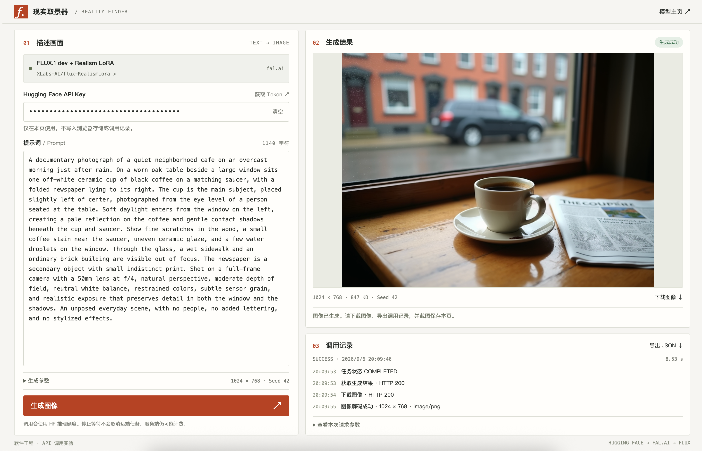

# Hugging Face API 图像生成记录

我用 HTML、CSS 和原生 JavaScript 做了一个静态网页，输入 Hugging Face API Key 和提示词后调用 `XLabs-AI/flux-RealismLora`。2026 年 9 月 6 日，我依次使用中文、简短英文和长英文提示词生成了三张图。三次调用都返回了图像，第一张偏离了要求，后两张呈现了咖啡馆的窗边场景。我把第三张作为最终结果。

## API 调用的操作步骤

### 1. 准备账号和 Token

在 [Hugging Face 官网](https://huggingface.co/join)注册个人账号，完成邮箱验证。登录后进入 [Access Tokens](https://huggingface.co/settings/tokens)，创建 `Fine-grained` Token，填写名称，并勾选调用 Inference Providers 的权限。创建后复制以 `hf_` 开头的 Token，填入网页的 API Key 输入框。权限说明见 [HF Token 文档](https://huggingface.co/docs/hub/security-tokens)。

页面使用 HF Token，通过 Hugging Face 的路由调用 fal.ai。调用前可以在 [Inference Providers 设置](https://huggingface.co/settings/inference-providers)检查服务配置，在 [Billing](https://huggingface.co/settings/billing)检查额度。费用按 [HF 计费说明](https://huggingface.co/docs/inference-providers/pricing)执行。

### 2. 打开前端页面

直接用浏览器打开 [index.html](index.html)，或在仓库根目录执行：

```bash
python3 -m http.server 8000 --bind 127.0.0.1 --directory homework1/hf-api
```

然后访问 [本地页面](http://127.0.0.1:8000)。服务器只提供静态文件，生成请求由浏览器发送，不需要安装前端依赖。

页面左侧是 API Key、提示词和生成参数，右侧是图像预览和调用记录。提示词输入框初始为空。下面三版提示词保留在本文中，使用时复制到输入框。

### 3. 输入提示词并提交

填入 Token 后，输入第一版中文提示词，点击「生成图像」。本轮结束后保存页面截图，再替换为第二版英文短句，最后使用第三版长英文提示词。

三张截图中的模型均为 `XLabs-AI/flux-RealismLora`，服务商为 fal.ai，图片尺寸为 `1024 × 768`，种子为 `42`。当前代码固定传入 28 个生成步数、3.5 的引导系数和 1 的 LoRA 权重。三轮对照围绕提示词展开。

每次只生成一张图。生成期间按钮禁用，防止重复提交。页面会显示连接、排队、生成和下载状态。

### 4. 保存结果与记录

图像显示后，点击「下载图像」可保存原图，点击「导出 JSON」可保存本轮请求和响应记录。截图同时保留提示词、图像、成功状态和下方日志。每轮结束后先保存，再发起下一次请求；新请求和刷新页面都会清除上一轮在页面中的记录。

三张截图中的 API Key 都以圆点遮挡。代码不把 Token 写入浏览器存储或导出记录。浏览器的 Network 面板仍能看到授权头，截图时应避开 `Authorization`。

## 代码如何完成调用

[index.html](index.html)定义表单和结果区域，[styles.css](styles.css)处理布局，[app.js](app.js)读取输入、提交请求、查询任务和显示图片。

`XLabs-AI/flux-RealismLora` 是 `FLUX.1-dev` 的写实 LoRA，模型关系见 [模型主页](https://huggingface.co/XLabs-AI/flux-RealismLora)。代码先读取模型的公开推理服务映射：

```javascript
const MODEL = "XLabs-AI/flux-RealismLora";
const ROUTER = "https://router.huggingface.co/fal-ai";
const MAPPING_URL =
  `https://huggingface.co/api/models/${MODEL}?expand=inferenceProviderMapping`;

const metadata = await jsonRequest(MAPPING_URL, {
  signal,
  label: "读取模型映射"
});
const mapping = metadata.inferenceProviderMapping?.["fal-ai"];
```

代码检查服务状态、任务类型和 LoRA 权重文件，再组装请求。2026-09-06 检查时，服务模型名为 `fal-ai/flux-lora`，权重文件为 `lora.safetensors`。页面运行时读取映射，不把普通 FLUX 模型当作指定 LoRA 的替代品。

下面是请求参数的主要部分。`prompt`、`width`、`height` 来自表单；这些片段是调用流程节选，完整错误处理见 `app.js`。

```javascript
const parameters = {
  prompt,
  image_size: { width, height },
  num_inference_steps: 28,
  guidance_scale: 3.5,
  num_images: 1,
  output_format: "png",
  enable_safety_checker: true
};
if ($("seed").value !== "") parameters.seed = Number($("seed").value);

parameters.loras = [{
  path: `https://huggingface.co/${MODEL}/resolve/main/${mapping.adapterWeightsPath.split("/").map(encodeURIComponent).join("/")}`,
  scale: 1
}];

const endpoint = `${ROUTER}/${mapping.providerId}?_subdomain=queue`;
let task = await jsonRequest(endpoint, {
  token, body: parameters, signal, label: "提交生成请求"
});
```

`jsonRequest()` 内部调用 `request()`，后者通过 `fetch()` 发送 JSON，并在请求头中传入 `Authorization: Bearer <Token>`。授权只发给 HF Router，模型映射查询和图片下载不带 Token。路由及 LoRA 参数的处理参考 [HF 的 fal.ai 适配代码](https://github.com/huggingface/huggingface.js/blob/main/packages/inference/src/providers/fal-ai.ts)，参数格式见 [fal.ai FLUX LoRA API](https://fal.ai/models/fal-ai/flux-lora/api)。

提交返回的是任务信息。代码读取 `request_id`、`status_url` 和 `response_url`，把后两个地址转成 HF Router 地址。任务未完成时，每隔两秒查询一次状态。`IN_QUEUE` 表示排队，`IN_PROGRESS` 表示正在执行，`COMPLETED` 表示可以读取结果。队列接口说明见 [fal.ai 文档](https://fal.ai/docs/documentation/model-apis/inference/queue)。

任务完成后，代码获取结果并下载图片：

```javascript
const result = await jsonRequest(resultUrl, {
  token, signal, label: "获取生成结果"
});
const image = result.images?.[0];
const response = await request(image.url, {
  signal, label: "下载图像"
});
const blob = await response.blob();

imageObjectUrl = URL.createObjectURL(blob);
$("result-image").src = imageObjectUrl;
await $("result-image").decode();
```

完整代码还会检查 HTTP 状态、图像地址、文件类型和文件大小。图片解码通过后，页面才记录 `success` 并显示「生成成功」。这表示接口返回的图片已经显示，不表示图片内容符合提示词。

记录中的总耗时用 `performance.now()` 计算，从发起模型映射查询前开始，到图片解码和状态更新后结束。它包含网络请求、排队、轮询间隔及图片下载，不是模型单独的推理时间。

## 三次调用的记录

以下数据来自三张页面截图。日期均为 2026-09-06，时间按页面显示记录。图片均为 PNG，尺寸为 `1024 × 768`，Seed 为 `42`。

| 次数 | 提示词 | 开始时间 | 图像解码成功时间 | 总耗时 | 图片大小（页面显示） |
| --- | --- | --- | --- | --- | --- |
| 第一次 | 中文，44 字符 | 20:07:14 | 20:07:32 | 17.92 秒 | 1119 KB |
| 第二次 | 简短英文，103 字符 | 20:09:14 | 20:09:22 | 7.91 秒 | 842 KB |
| 第三次 | 长英文，1140 字符 | 20:09:46 | 20:09:55 | 8.53 秒 | 847 KB |

三张截图都显示 `SUCCESS`、任务状态 `COMPLETED`，以及获取结果和下载图像时的 HTTP 200。最后一条日志是图像解码成功。截图只保留了末尾几条日志，没有展开完整请求参数，也没有显示任务编号；本文不补写这些字段。

### 第一次：中文提示词，结果偏题

```text
一张真实的照片：雨后的街边咖啡馆，窗边的木桌上放着一杯咖啡，旁边有一份报纸，背景是街道。
```


我先用中文列出场景和物体，希望得到雨后咖啡馆窗边的照片。提示词包含木桌、咖啡、报纸和街道，没有规定光线方向和物体位置。

返回的图像是两个穿古装的卡通人物，背景有庭院、建筑和树木。画面没有咖啡、木桌或报纸，也没有呈现照片风格。这一轮的接口调用成功了，但图像没有完成提示词描述的任务。

这一轮偏题的原因是模型对中文提示词的支持不足。提示词已经写明咖啡馆、木桌、咖啡和报纸，模型却没有按这些内容生成画面。因此，下一轮我保留场景，改用英文短句。

### 第二次：英文短句，场景符合要求

```text
A realistic photo of a cup of coffee and a newspaper on a wooden table beside a cafe window after rain.
```


针对第一轮的中文支持问题，第二版把场景改写成英文，仍然只描述咖啡、报纸、木桌、窗户和雨后环境。返回的图像中，蓝绿色杯子放在杯碟上，杯碟压在展开的报纸上。木桌靠近窗户，玻璃上有水滴，窗外可以看到模糊的建筑和车辆。室内还有暖色灯光和植物。

这张图已经具有照片的外观。杯子和桌面是清楚的，背景有虚化，主要物体与提示词一致。短句没有规定杯子和报纸的相对位置，也没有限定光源，模型补入了灯具、植物和室内布置。

我希望把画面集中到杯子上，让报纸放在一旁，并用窗外的自然光照亮桌面。第三版因此补充构图、光线和材质细节。

### 第三次：长英文提示词，作为最终结果

```text
A documentary photograph of a quiet neighborhood cafe on an overcast morning just after rain. On a worn oak table beside a large window sits one off-white ceramic cup of black coffee on a matching saucer, with a folded newspaper lying to its right. The cup is the main subject, placed slightly left of center, photographed from the eye level of a person seated at the table. Soft daylight enters from the window on the left, creating a pale reflection on the coffee and gentle contact shadows beneath the cup and saucer. Show fine scratches in the wood, a small coffee stain near the saucer, uneven ceramic glaze, and a few water droplets on the window. Through the glass, a wet sidewalk and an ordinary brick building are visible out of focus. The newspaper is a secondary object with small indistinct print. Shot on a full-frame camera with a 50mm lens at f/4, natural perspective, moderate depth of field, neutral white balance, restrained colors, subtle sensor grain, and realistic exposure that preserves detail in both the window and the shadows. An unposed everyday scene, with no people, no added lettering, and no stylized effects.
```



这一版先确定阴天雨后的时间，再写明米白色陶瓷杯、黑咖啡、杯碟和放在右侧的折叠报纸。杯子是主体，相机放在坐着的人的视线高度。左侧窗光、咖啡表面的反光和杯底阴影用于约束光照关系。

我加入木头划痕、咖啡渍、釉面差异和窗上水滴，想让物体带有使用痕迹。`50mm`、`f/4` 和中等景深描述的是预期的透视与清晰范围，不代表 API 设置了真实相机。末句要求不出现人物、额外文字和风格化效果。

返回的图像中，浅色杯子和杯碟位于桌面中部，杯内是黑咖啡。报纸移到了右侧，没有再铺在杯碟下方。窗外有湿路面、砖色建筑和车辆，背景虚化。桌面的木纹、划痕、反光和杯底阴影可以看见，画面没有第二张中的灯具和植物。

我把这张作为最终结果。杯子与报纸分开，画面中的物体更接近我写下的位置关系，光线也以窗光为主。它仍有偏差：杯子没有明显偏左，报纸标题仍较醒目，咖啡渍和釉面差异在截图中不容易确认。增加描述后，模型执行了其中一部分，并没有逐条实现。

第三次截图中的末尾日志如下：

```text
20:09:53  任务状态 COMPLETED
20:09:53  获取生成结果 · HTTP 200
20:09:54  下载图像 · HTTP 200
20:09:55  图像解码成功 · 1024 × 768 · image/png
```

## 三次结果的对照

| 对照项 | 第一次：中文 | 第二次：英文短句 | 第三次：长英文 |
| --- | --- | --- | --- |
| 场景 | 古装人物与庭院，偏离要求 | 咖啡馆窗边，主体齐全 | 窗边静物，主体齐全 |
| 风格 | 卡通插画 | 照片风格，有室内暖色灯光 | 照片风格，以窗光为主 |
| 杯子与报纸 | 都未出现 | 杯碟压在展开的报纸上 | 杯碟与报纸分开，报纸在右侧 |
| 提示词执行情况 | 没有呈现所写场景 | 场景符合，布局由模型补充 | 实现了多项构图和材质要求，仍有细节未落实 |
| 本轮结论 | 模型对中文提示词的支持不足，导致偏题 | 改用英文后，场景符合要求 | 作为最终结果 |

第二张已经符合写实场景的要求。第三张的变化主要在物体关系、光源和画面取舍，不能只因提示词更长就认定质量更高。这三轮都使用 Seed 42。对本次使用的模型和场景，英文提示词能得到符合描述的结果，因此后续修改都以英文为基础。

## API 调用的体验和心得

第一次等了 17.92 秒，后两次分别是 7.91 秒和 8.53 秒。后两次的等待时间接近，修改一轮提示词后，可以在十秒左右看到结果。第一轮为什么更慢，截图没有给出足够信息。总耗时还包含请求和下载，不能把差异直接归因于模型加载或提示词长度。

这次调用让我把两个检查分开了。一个是接口有没有返回图片，另一个是图片有没有画出所写的内容。第一张的 HTTP 状态和解码都正常，但模型对中文提示词的支持不足，画面偏离了咖啡馆场景。只看「生成成功」会漏掉这个问题。换成英文后，场景才符合要求，之后再补充构图和光线。

提示词的修改也有了具体目标。第二张之后，我写明报纸放在右边、杯子作为主体、光从窗户进入。第三张出现了这些变化。相对位置和光照关系可以拿着图逐项核对，比一句「更真实」更容易判断。

前端把填写提示词、等待任务和查看图像放在同一页，省去了每轮修改调用代码的步骤。日志保留了任务完成、获取结果和下载图片的状态，截图也能同时记录输入和输出。需要继续排查时，导出的 JSON 可以提供请求参数和任务编号。

页面每轮会覆盖上一轮内容，因此保存结果要放在下一次提交之前。API Key 保持遮挡，完整 Token 不进入作业截图。长时间没有返回时，也不能只靠重复点击解决：本页的「停止等待」和 180 秒超时只结束浏览器等待，远端任务可能仍在执行或计费。

## 出错时的检查方法

| 状态 | 检查内容 |
| --- | --- |
| HTTP 401 | Token 是否完整、过期或被撤销 |
| HTTP 402 | HF 推理额度和账单 |
| HTTP 403 | Inference Providers 权限和模型访问限制 |
| HTTP 404 或模型不可用 | 模型主页是否仍提供对应推理服务 |
| HTTP 422 | 请求参数及服务端错误正文 |
| HTTP 429 | 请求频率和额度 |
| HTTP 5xx | 服务状态，保留任务编号后再重试 |
| 网络请求失败 | 网络连接及浏览器控制台中的跨域错误 |

三张截图中没有出现这些错误。它们是页面保留的排查入口，不属于本次三轮调用的失败记录。
