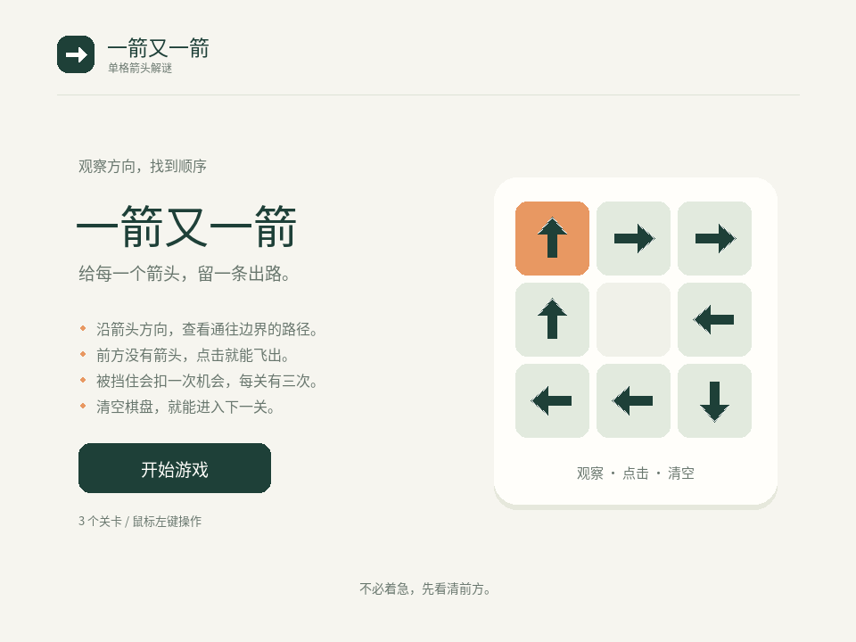
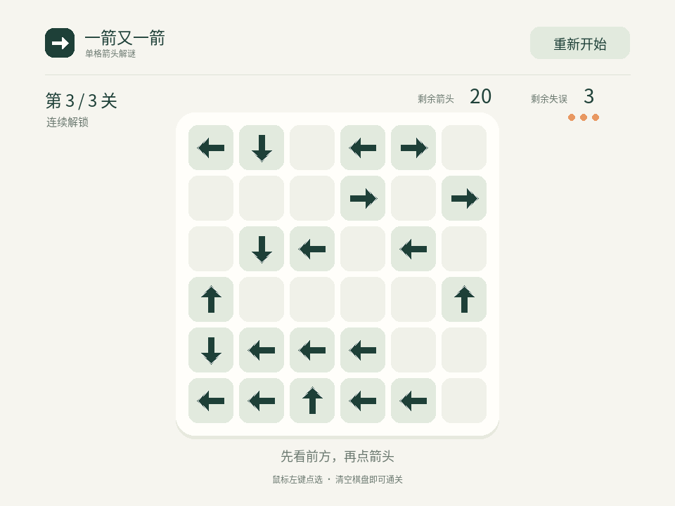
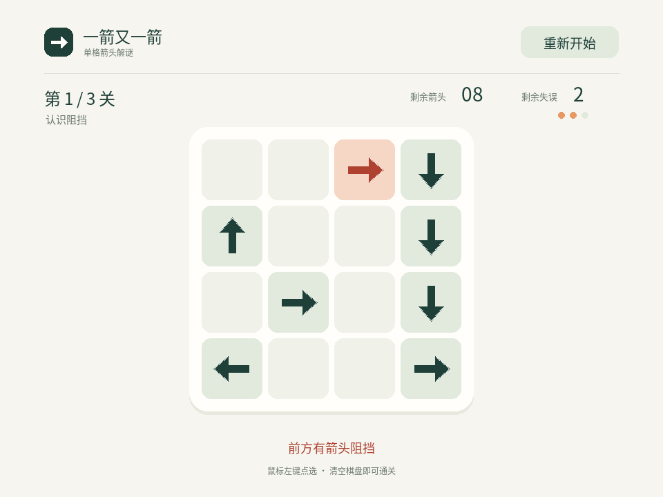
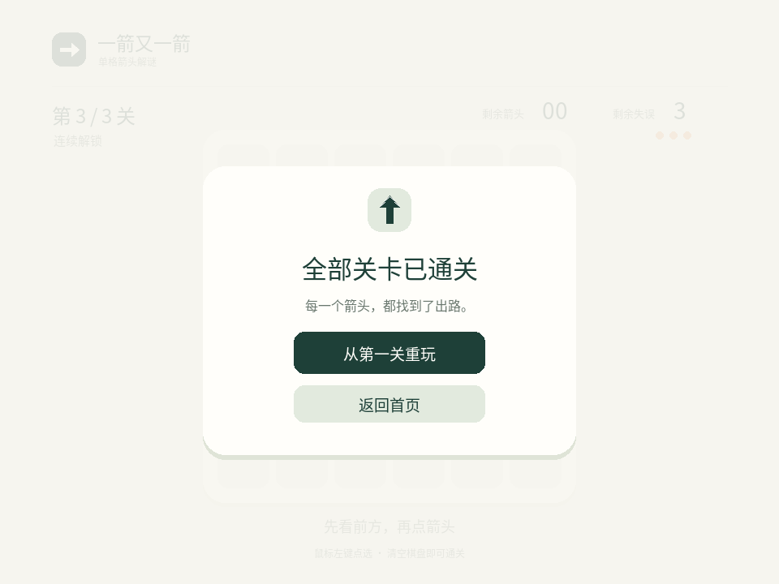
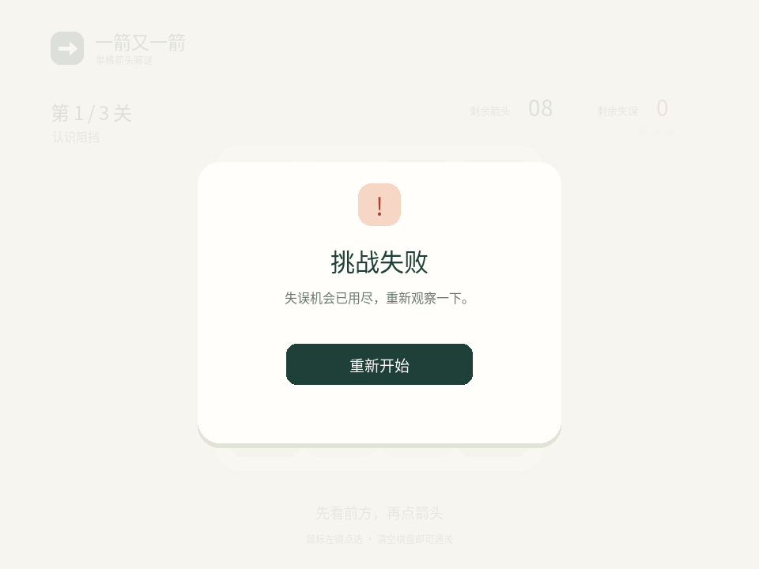

# 一箭又一箭

用 Python 编写的单格箭头解谜游戏。沿箭头方向观察到棋盘边界：前方没有其他箭头时，点击使它飞出；被挡住时扣一次失误机会。每关有 3 次机会，清空棋盘即可通关。

包含 PRD 中的 3 个固定关卡、开始界面、飞出和碰撞动画、失败重试、关卡切换及最终通关界面。运行时不需要联网或调用 AI 服务。

## 安装与运行

已验证环境：macOS 15.7.9（Apple Silicon）、CPython 3.14.7、pygame-ce 2.5.8 / SDL 2.32.10。Windows 和 Linux 尚未实际验证。

在仓库根目录执行：

```bash
cd homework2
python3 -m venv .venv
source .venv/bin/activate
python -m pip install -r requirements.txt
python main.py
```

窗口大小为 960 × 720。运行依赖只有 pygame-ce，代码中仍使用 `import pygame`。请在独立虚拟环境中安装，避免与同名模块的其他发行包混用。中文字体随仓库附带，不需要安装系统字体。也可以从其他目录用绝对路径运行 `main.py`。

已通过新建环境检查：仅安装 `requirements.txt` 后运行测试和图形程序，不依赖开发用的 FontTools。

## 操作

- 点击“开始游戏”进入第 1 关。
- 鼠标左键点选箭头所在的整格。箭头只能沿自身方向飞出，不能旋转。
- 路径可以跨过空格；只要前方还有箭头就会被挡住，不论阻挡箭头的朝向。
- 碰撞时箭头变色并晃动，提示“前方有箭头阻挡”，剩余失误减 1。机会耗尽后显示失败。
- 飞出或碰撞期间忽略棋盘点选。右键、空格、棋盘外区域和长按不产生连续动作。
- “重新开始”恢复当前关卡，动画期间也能立即重开。
- 通关后点击“下一关”继续。最后一关完成后可从第一关重玩或返回首页。
- 在任意界面关闭窗口即可退出。

## 游戏画面

以下截图由本程序运行生成。











## 自动化测试

激活环境后，在 `homework2/` 下执行：

```bash
python -m unittest discover -s tests -v
```

规则测试使用标准库 `unittest`。界面测试使用 SDL 虚拟显示器，不弹出窗口；涵盖实际鼠标事件、事件队列、字库、布局及退出流程。详见 [测试报告](docs/test-report.md)。

只运行不依赖 Pygame 的规则测试：

```bash
python -m unittest discover -s tests -p test_game.py
```

通过界面事件自动通关并生成截图：

```bash
# 实际桌面窗口，按 60 FPS 上限推进动画。
python tools/capture_screenshots.py
# 无显示器的环境，使用固定时间步长。
python tools/capture_screenshots.py --headless --output /tmp/arrow-puzzle-screenshots
```

这是自动化检查。PRD 要求的提交者本人逐关试玩仍需本人完成，记录位置在测试报告中。

## 代码说明

| 文件 | 内容 |
| --- | --- |
| `main.py` | 程序入口 |
| `levels.py` | 不可变关卡模板、布局校验与 3 个固定关卡 |
| `game.py` | 路径判断、可解性检查、失误次数、状态和动作计时 |
| `ui.py` | 窗口、绘制、坐标映射、鼠标事件与动画表现 |
| `tests/` | 规则与界面自动化测试 |
| `tools/` | 自动通关截图、开发用字体裁剪脚本 |
| `assets/` | 中文字体子集、字符清单、字体许可与来源 |
| `docs/` | 测试报告、截图、真实 AIGC 协作和时间记录 |

`can_exit` 从目标箭头的前一格开始，按方向逐格检查到边界，遇到任意箭头就返回失败。检查先判断边界再读取格子，避免 Python 负索引绕到另一侧。

`Game` 每次加载关卡都复制模板；剩余箭头数直接从棋盘计算。碰撞立即扣一次机会，反馈结束后决定是否失败；飞出动作结束后才清空格子并决定是否通关。重开直接丢弃当前动作。

`solve_level` 只用于开发验证：反复删除当前可飞出的箭头，清空则说明可解。删除不会产生新的阻挡，所以无需穷举点击顺序。PRD 中的三组解序也在规则测试中独立验证。

## 来源与开发记录

- 需求及关卡布局来自本目录的 [PRD](PRD.md)。
- 图形库使用 [pygame-ce](https://github.com/pygame-community/pygame-ce)。
- 字体由 Noto Sans SC Regular 2.004 裁剪、重命名而来；来源、版权、许可和再生成方法见 [assets/README.md](assets/README.md)。
- 箭头、棋盘和按钮由程序绘制，没有使用商业游戏素材或完整项目代码。
- 使用 Codex 和并行子代理协助实现与检查，见 [AIGC 记录](docs/aigc-log.md) 与 [时间记录](docs/psp.md)。

本次交付不包含博客内容。
